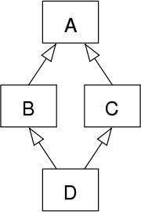

# 디폴트 메서드 
 ## 인터페이스 정의하는 방법
##### 1.	정적 메서드
##### 2.	디폴트 메서드 
기존의 인터페이스는 public 메서드만을 지원했고, public 메서드는 구현 클래스에서 반드시 구현하도록 강제되어 있었다. 디폴트 메서드는 구현 클래스에서 반드시 구현하지 않아도 컴파일 오류가 없이 넘어감 

#### 정적(static) 메서드
자바 8에서는 인터페이스에 직접 정적 메서드를 선언할 수 있으므로 유틸리티 클래스를 없애고 직접 인터페이스 내부에 정적 메서드를 구현할 수 있으나, 과거 버전과의 호환성을 위해 자바 API에 유틸리티 클래스가 남아있다.

* API의 변화  
&nbsp; &nbsp; 이미 릴리스된 API를 수정하면, 사용자가 만든 클래스도 같이 수정이 되어야 한다. 즉 기존버전과의 호환성 문제가 발생한다. 이때 디폴트 메서드를 사용하면 새롭게 바뀐 인터페이스에서 자동으로 기본 구현을 제공하므로 기존 코드를 고치지 않아도 된다.  

* 자바 프로그램의 호환성 문제   
&nbsp; &nbsp; **1.	바이너리 호환성 :** 뭔가 바꾼 후에도 에러 없이 기존 바이너리가 실행될 수 있는 상황  
&nbsp;&nbsp;&nbsp;	인터페이스에 메서드 추가 시, 추가된 메서드를 호출하지 않는 한 문제 발생하지 않음  
&nbsp; &nbsp; **2.	소스 호환성 :**  코드를 고쳐도 기존 프로그램을 재컴파일 할 수 있는 것.   
&nbsp; &nbsp; **3.	동작 호환성 :** 코드를 바꾼 다음에도 같은 입력값이 주어지면 같은 동작을 실행하는 것.  

#### 디폴트 메서드 
기존의 인터페이스 내부의 메서드는 구현 클래스에서 구현하는 반면, 디폴트 메서드는 인터페이스 내부에서 구현한다. 즉 메서드 바디를 가진다.
 
> Public interface Test{  
Default void defaultMethod(){  
&nbsp;	System.out.println(“디폴트 메서드는 메서드 바디를 가진다”);    
&nbsp;&nbsp; &nbsp;&nbsp; }  
&nbsp;&nbsp;&nbsp;&nbsp; Public void usualMethod();  
}

또한 이 인터페이스를 구현하는 모든 클래스는 디폴트 메서드의 구현도 상속받는다. 소스 호환성이 유지된다고 볼 수 있다.

* 인터페이스와 추상클래스의 차이  
&nbsp;&nbsp;&nbsp;&nbsp; 둘 다 추상 메서드와 바디를 포함하는 메서드를 정의 할 수 있다…그러나  
&nbsp;&nbsp;&nbsp;**1.**	클래스 = 단일 상속, 인터페이스 = 다중 상속 가능   
&nbsp;&nbsp;&nbsp;**2.**	추상클래스는 인스턴스 변수로 공통 상태를 가질 수 있으나 인터페이스는 인스턴스 변수를 가질 수 없다.  

* 디폴트 메서드 활용 패턴   
	* 선택형 메서드  
		&nbsp;&nbsp;&nbsp;Interator 인터페이스에서의 remove 메서드. 클래스에서 메서드를 빈 상태로 구현. 디폴트 메서드로 기본 구현을 제공하면 쓸데없이 빈 remove 메서드를 구현 클래스에서 구현할 필요가 없어진다.  
	* 동작 다중상속   
		&nbsp;&nbsp;&nbsp;다중 상속 형식
		
~ 상속을 받는 클래스는 서브 형식이 된다.   
 
 **기능이 중복되지 않는 최소의 인터페이스**   
&nbsp;&nbsp;&nbsp;:템플릿 디자인 패턴과 유사한 방식으로, 디폴트 구현을 이용해서 효율적으로 인터페이스를 짤 수 있다.

      
 **인터페이스 조합**   
&nbsp;&nbsp;&nbsp; : 인터페이스를 조합하여 각 기능들을 조합한 다양한 클래스를 구현할 수 있다.    

##### 해석 규칙   
&nbsp; &nbsp; &nbsp; **1.**	클래스가 항상 이긴다. 디폴트 메서드보다 클래스에서 정의한 메서드가 우선  
&nbsp; &nbsp; &nbsp; **2.**	1번 외의 상황에서는 가장 하위의 서브 인터페이스가 이긴다. B가 A를 상속받는다면 B의 메서드가 우선  
&nbsp; &nbsp; &nbsp; **3.**	1,2번을 거치고도 디폴트 메서드의 우선순위가 결정되지 않았다면, 상속받는 클래스에서 명시적으로 디폴트 메서드를 오버라이드 하고 호출해야 한다.  

##### 충돌 해결  
&nbsp; &nbsp; &nbsp;  우선순위가 같은 동일 시그너처의 메서드를 동시에 상속받게 되면 충돌이 발생한다. 따라서 개발자가 직접 사용하려는 메서드는 명시적으로 선택해야 한다. 

   * 다이아몬드 문제

**Q1.** A에 디폴트 메서드가 있다고 하면, 이미지에서 D는  B, C 중 누구의 디폴트 메서드를 상속 받을까?  
###### 어차피 선택할 수 있는 메서드 선언은 A만 정의하고 있으므로 A의 메서드를 실행한다.   

**Q2.** 만일 B에도 같은 시그너처의 디폴트 메서드가 있다면?   
###### B가 선택된다.  

**Q3.** B, C모두 동일 디폴트 메서드를 정의한다면?
 ###### 충돌이 발생하므로, 둘 중 한쪽의 메서드를 명시적으로 호출해야 한다.  

 ::: 만약 A에 default void hello(){}; 를 정의한 후,   
>Public interface extends C{  
	&nbsp;&nbsp;&nbsp; Void hello();   
}

와 같이 C에 디폴트 메서드가 아닌 동일한 메서드를 정의하게 되면?  
###### C가 A보다 우선권을 갖게 되고, 컴파일 에러가 발생한다고…. D에서 어떤 hello를 사용할지 명시적으로 선택해서 에러를 해결해야 한다고 함  

